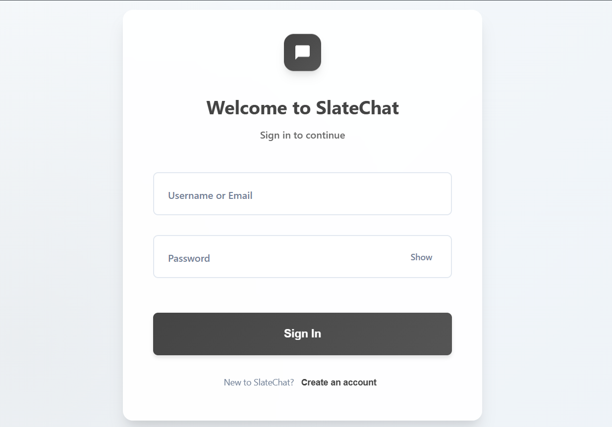
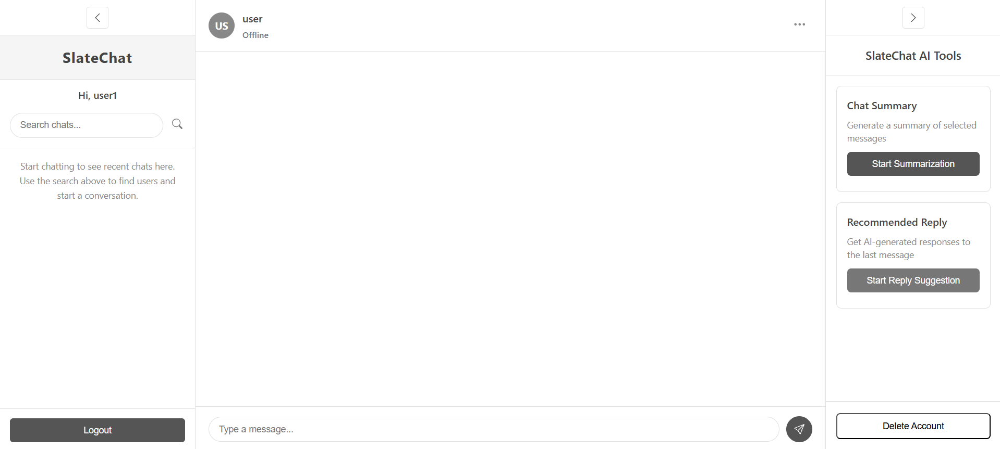

# SlateChat

SlateChat is a modern, real-time chat application built with the MERN stack and Socket.IO. It offers secure user authentication, live messaging, AI-powered chat features, and a responsive, user-friendly interface.

<p align="center">
  <a href="https://chat-app-frontend-tc6y.onrender.com" target="_blank">
    <strong>🚀 Live Demo</strong>
  </a>
</p>

---

## 📋 Table of Contents

* [Features](#-features)
* [Screenshots](#-screenshots)
* [Tech Stack](#-tech-stack)
* [Getting Started](#-getting-started)
  * [Prerequisites](#prerequisites)
  * [Installation](#installation)
  * [Environment Variables](#environment-variables)
  * [Running the Application](#running-the-application)
* [Usage](#-usage)
* [Folder Structure](#-folder-structure)
* [License](#-license)
* [Acknowledgements](#-acknowledgements)

---

## 🚀 Features

* **User Authentication**: Register and log in with JWT-based sessions.
* **Real-Time Chatting**: One-to-one chat powered by Socket.IO for instant message delivery.
* **Online/Offline Indicators**: See who’s available at a glance.
* **Read Receipts**: Know when your messages have been seen.
* **Message Deletion**: Delete messages with a `[deleted message]` placeholder.
* **Date Grouping**: Chats grouped by day with date labels.
* **Responsive UI**: Optimized for desktop and mobile screens.
* **Sidebar**: Recent chats list with search functionality.
* **AI Suggested Replies**: Get instant, context-aware reply suggestions powered by Google Gemini API.
* **Chat Summarisation**: Summarise selected chat messages using Gemini for quick overviews.
* **Account Management**: Delete your account and all related messages securely.

---

## 📸 Screenshots

<table>
  <tr>
    <td></td>
    <td></td>
  </tr>
</table>

---

## 🛠 Tech Stack

| Layer          | Technologies                        |
| -------------- | ----------------------------------- |
| Frontend       | React, Context API, CSS             |
| Backend        | Node.js, Express, MongoDB, Mongoose |
| Real-time      | Socket.IO                           |
| AI Integration | Google Gemini API                   |
| Authentication | JSON Web Tokens (JWT)               |
| Deployment     | Render                              |

---

## 🏁 Getting Started

Follow these steps to get SlateChat running locally.

### Prerequisites

* **Node.js** v18 or higher
* **MongoDB** (local instance or Atlas cluster)

### Installation

1. **Clone the repository**

   ```bash
   git clone https://github.com/bsricharan14/chat-app.git
   cd chat-app
   ```

2. **Install dependencies**

   ```bash
   # In the backend folder
   cd backend
   npm install

   # In the frontend folder (in a new terminal tab)
   cd ../frontend
   npm install
   ```

### Environment Variables

Create a `.env` file in the `backend` and `frontend` directories with the following values:

* **backend/.env**

  ```dotenv
  MONGO_URI=mongodb://localhost:27017/chat-app
  JWT_SECRET=your_jwt_secret
  PORT=5000
  GEMINI_API_KEY=your_gemini_api_key
  ```

* **frontend/.env**

  ```dotenv
  REACT_APP_API_URL=http://localhost:5000
  ```

### Running the Application

1. **Start the backend server**

   ```bash
   cd backend
   npm run dev
   ```

2. **Start the frontend**

   ```bash
   cd frontend
   npm start
   ```

3. **Open your browser**
   Navigate to [http://localhost:3000](http://localhost:3000)

---

## 💡 Usage

1. Register a new account or log in with existing credentials.
2. Select a contact from the sidebar or search for a user.
3. Start chatting in real time, view online status, and manage your messages.
4. Use AI-powered reply suggestions and chat summarisation for enhanced productivity.
5. Delete messages or your account as needed.

---

## 📂 Folder Structure

```
slatechat/
├── backend/               # Express server, API routes, and Socket.IO setup
│   ├── config/
│   ├── middleware/
│   ├── models/
│   ├── routes/
│   ├── server.js
│   └── .env
├── frontend/              # React app with Context API and CSS modules
│   ├── public/
│   ├── src/
│   │   ├── components/
│   │   ├── contexts/
│   │   ├── pages/
│   │   ├── styles/
│   │   └── App.js
│   └── .env
└── README.md
```

---

## 📜 License

This project is licensed under the MIT License. See the [LICENSE](LICENSE) file for details.

---

## 🙏 Acknowledgements

* [Create React App](https://github.com/facebook/create-react-app)
* [Socket.IO](https://socket.io/)
* [MongoDB](https://www.mongodb.com/)
* [Express](https://expressjs.com/)
* [Mongoose](https://mongoosejs.com/)
* [Google Gemini API](https://ai.google.dev/)
* Some parts of this project were developed with the help of **GitHub Copilot** and other **AI-assisted tools** for learning and exploration purposes.

---

*Work in progress — new features and improvements coming soon!*

---
